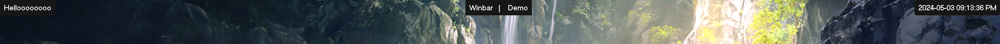

# winbar

A Windows 10/11 Status Bar.

[]()

`winbar` is quite different from other status bars in that it provides more straightforward
configuration. What this means is that you spend less time configuring the status bar, and have
something that just _works_ and generally looks good.

Of course, you can still change colours and formats of components (available configuration depends
on the component), but you wouldn't be able to change every little detail about how the component is
displayed.

## How does it work?

`winbar` is divided into two components: the CLI (`winbarc`) and the actual status bar app itself
(`winbar`). The CLI can be used to control `winbar`.

`winbar` (the app) runs a TCP server for clients to connect to (in this case, just `winbarc`). It
uses a simple JSON-based request-response protocol. If you're curious/want to make your own client,
see [protocol.rs](./winbar/src/protocol.rs).

## Components

Components are an individual block within the status bar displaying some specific thing. For
example, the datetime component, as the name suggests, displays the current date and time within the
status bar.

### Available Components

The following components are available natively by `winbar`:

- Static Text - displays some static text
- DateTime - displays the current date/time

## Configuration

See [Configuration](./docs/configuration.md).

## Downloading / Installing

`winbar` and `winbarc` can be downloaded from
[Releases](https://github.com/Sulaxan/winbar/releases). There currently isn't a convenient
installation process, so for now, winbar and winbarc can be put in any location as long as it's in
your PATH.

If you wish to download the latest `main` branch build, you can download the artifacts from the
latest GitHub Action run.

## Usage

Once you have downloaded `winbar` and `winbarc` and it exists in your PATH, you will need to create
or generate the config. There is an [example config](./winbar.json) you can download, or run the
following command:

```
winbar --config-path <PATH> --generate-config
```

This will generate an example config in the given path.

To start `winbar`, you can either run `winbar` directly:

```
winbar --config-path <PATH>
```

or, use `winbarc` to start `winbar` and run it in the background:

```
winbarc start --config-path <PATH>
```

To stop winbar, run:

```
winbarc stop
```

That's the gist of it! There are more commands and options available that you can specify. Feel
free to use the `--help` option on any command (`winbar`, `winbarc`) or subcommand to see everything
available to you.

## Roadmap

- More configuration options for existing components
- New components
- Multi-monitor support
- Plugin system

## Credits

This project's layout and bits of code are inspired from the following:

- [komorebi](https://github.com/LGUG2Z/komorebi)

  - This project's high-level architecture is very similar to that of `komorebi` (separating
    CLI/actual status bar)
  - The window creation/drawing code structure in `winbar` was inspired by `komorebi`

- [gdiplus-rs](https://github.com/davidrios/gdiplus-rs)

  - `winbar`'s GDI+ setup and usage was greatly inspired by `gdiplus-rs`
